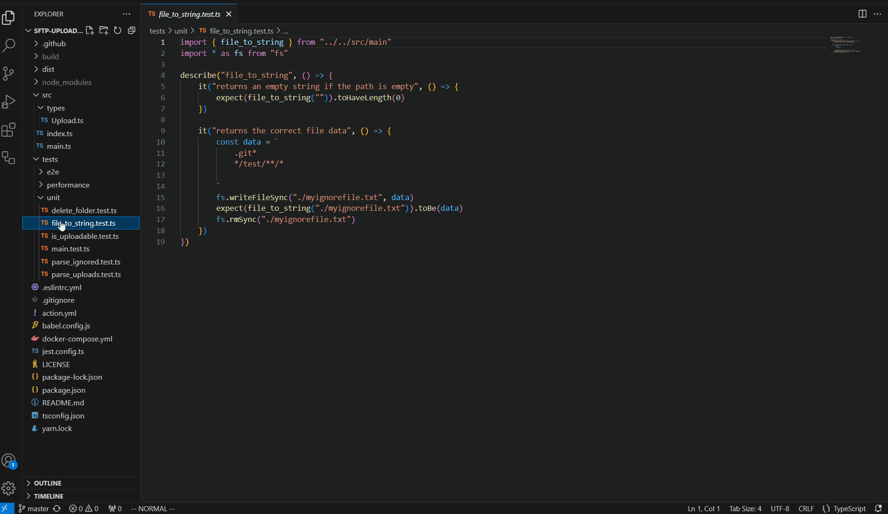

# Least Recently Used Tabs - VSCode Extension
This extension will close least recently used tabs and order them based on the most frequently accessed tabs.

## Why? 🤔

Have you ever been coding up a project and had to sort through all the open tabs to find the right file?

Have you ever had to continuously close tabs that you've finished working on?

This extension solves all of the above by keeping your workspace tidy... just keep the most recently used tabs open and forget about the rest! 😉

## Features 🎖️

* Tabs are sorted based on when they were most recently used
* Tabs that haven't been used for a while get removed
* If the tab is pinned or dirty (has unsaved changes), we'll keep it open, no questions asked 😏.
* Decide the maximum number of tabs to keep open.
* Decide whether or not you wish to close tabs.

## Extension Settings 📝

This extension contributes the following settings:

* `lrutabs.maxTabs`: Define the number of tabs to keep open at a given time.
* `lrutabs.closeTabs`: Whether to close least recently used tabs.
* `lrutabs.reorderTabs`: Whether to reorder tabs after click.
